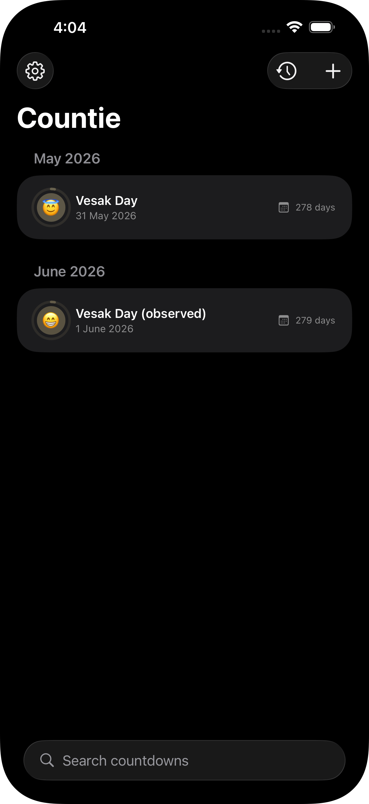
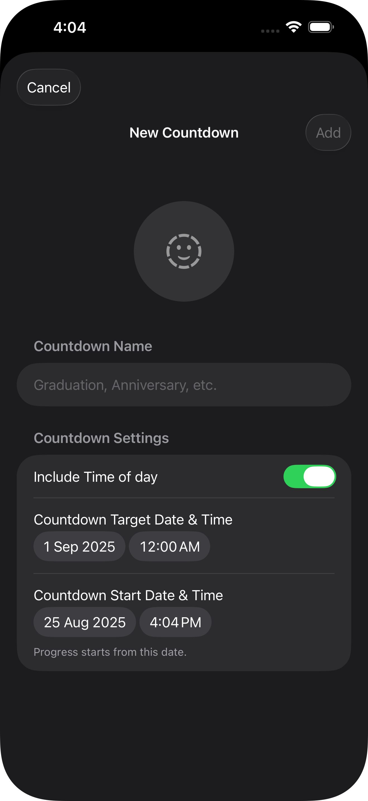
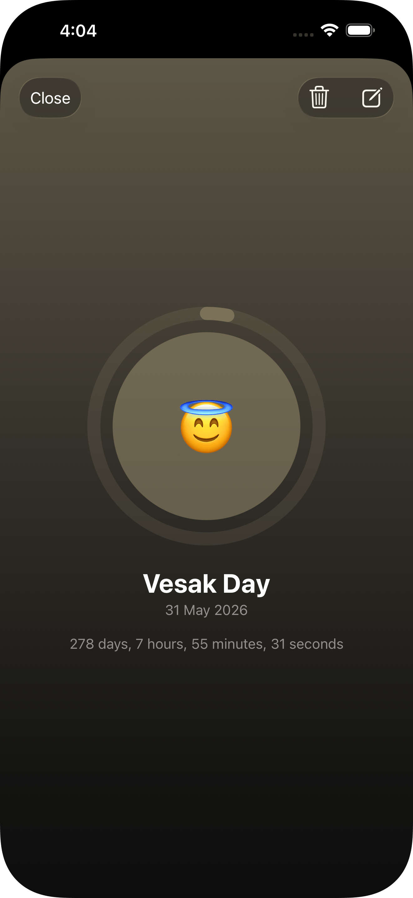
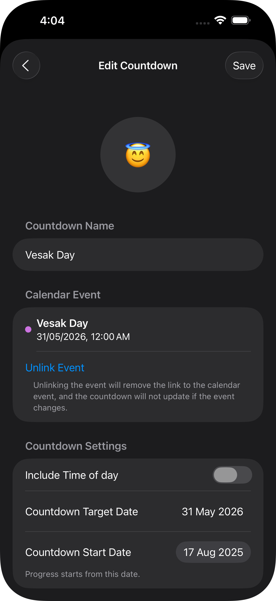
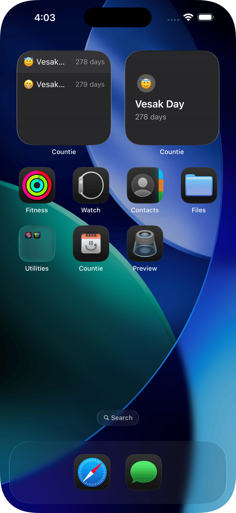

# Countie
> Track Life’s Milestones, One Countdown at a Time

<!-- screenshot images -->
<table>
<thead>
<td>Home Page</td>
<td>Add New Countdown</td>
<td>Countdown Details</td>
<td>Edit Countdown</td>
<td>Widget Preview</td>
</thead>
  <tr>
    <td></td>
    <td></td>
<td></td>
<td></td>
<td></td>
  </tr>
</table>

## Features
- **Lock Screen and Home Screen Widgets**: Keep track of your countdowns right on your lock and home screen. 
- **Multiple widget countdowns**: Add multiple widgets for different countdowns.
- **Calendar Event Countdowns**: Add a countdown based on any upcoming calendar events.
- **Reminders as the Event Approaches**: Get a friendly reminder just before your big day to make sure you’re ready.

## Installation
Countie is not yet available on the App Store. I'm currently working on it, perfecting the app to ensure it meets the highest standards before release.